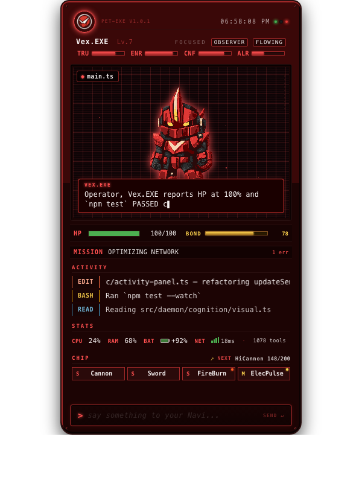
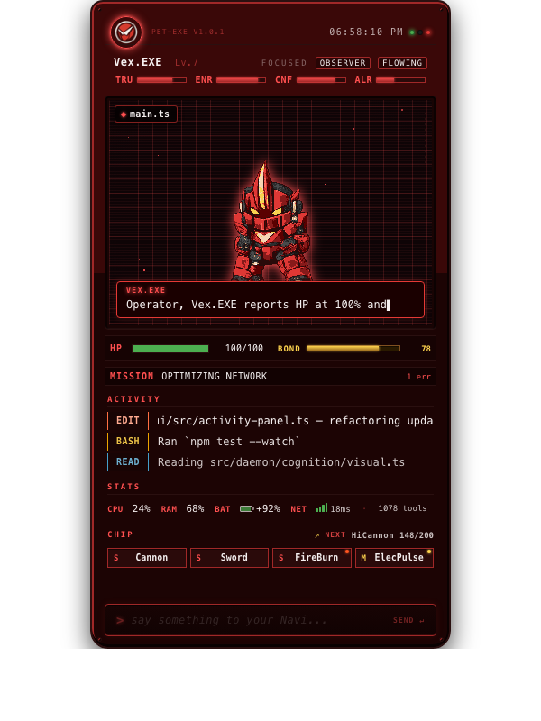

# ClaudeNavi

> A **MegaMan Battle Network-inspired NetNavi companion** for [Claude Code](https://claude.com/claude-code). A floating pixel-art desktop widget that watches you code, fights viruses (bugs), collects Battle Chips (milestones), and speaks to you in full BN dialogue style — powered by your existing Claude Code OAuth, no API key required.

<p align="center">
  
</p>

---

## Install

```bash
brew tap Topazoo/claudenavi
brew install claudenavi
brew services start claudenavi
claudenavi doctor
```

Works on **macOS** and **Linux (x86_64)**. ARM64 Linux works for CLI + daemon; the desktop widget is x86_64-only for now.

No API keys needed — the daemon spawns `claude -p` subprocesses and reuses your existing Claude Code OAuth session.

### Install directly from GitHub (without tapping)

If you'd rather not add the tap, you can install the formula directly:

```bash
# One-shot install from the raw formula URL
brew install --formula https://raw.githubusercontent.com/Topazoo/homebrew-claudenavi/main/Formula/claudenavi.rb
```

Or clone this repo and install from a local path:

```bash
git clone https://github.com/Topazoo/homebrew-claudenavi.git
brew install --formula ./homebrew-claudenavi/Formula/claudenavi.rb
```

Trade-off: direct install works, but `brew upgrade claudenavi` won't find new versions automatically. Tapping is recommended for normal use.

---

## What it does

ClaudeNavi runs as a background daemon that hooks into Claude Code. Every time Claude uses a tool (Read, Edit, Bash, etc.), the hook fires and the daemon reacts: sprite animations shift, mood changes, dialogue gets generated. Your Navi has its own personality, remembers sessions, and reacts to what you're actually doing — error streaks spawn viruses to battle, milestones unlock Battle Chips, late-night grinding changes its mood.

The widget is a Tauri v2 desktop app styled as a MegaMan Battle Network "PET" device. It connects to the daemon over WebSocket and renders in real time.

---

## Screenshots

The PET widget shows your Navi's current sprite, dialogue, activity feed, HP, stats, and Battle Chips. The sprite panel changes state in real time as you code.

<table>
  <tr>
    <td align="center"><br><i>Idle — resting between tool calls</i></td>
    <td align="center"><br><i>Jack-in — session start, thrusters firing</i></td>
    <td align="center"><br><i>Attack slash — in combat with a virus</i></td>
  </tr>
</table>

---

## Features

- **8 Navi archetypes**, each with distinct personality, stats, and color scheme — seeded deterministically from your username+hostname
- **Real-time sprite animations** reacting to your coding: 10 states (idle, thinking, battle stance, attack slash, attack projectile, damaged, victory, startled, excited, jack-in) × 6 frames each
- **Virus battles** triggered by error streaks, build failures, merge conflicts, test suite failures
- **25 Battle Chips** — milestones to unlock (code written, tests passed, commits made, viruses defeated)
- **Memory system** — episodes, reflections, themes. The Navi remembers what you worked on across sessions
- **Contextual dialogue** — Sonnet 4.6 generates replies grounded in your live state (HP, mood, recent files, error streak, recent mood shifts, relevant episodes). ~4s response time
- **4-axis emotion model** — Trust, Energy, Confidence, Alertness. Every event produces a causal EmotionEvent that feeds back into dialogue
- **Daily cost cap** — $15/day default with graceful template fallback once exceeded. Configurable via `CLAUDENAVI_DAILY_BUDGET_USD`
- **Self-tuning** — the daemon observes real metrics and proposes parameter adjustments every 2 hours, with an LLM reviewer that can accept/hold/reject each one

---

## The 8 archetypes

| Navi | Inspiration | Colors | Rarity |
|------|-------------|--------|--------|
| **Vex.EXE** | ProtoMan | Red/black, white visor | Common (20%) |
| **Pulse.EXE** | MegaMan | Blue/cyan | Common (20%) |
| **Volt.EXE** | ThunderMan | Yellow/white, electric blue | Common (20%) |
| **Forge.EXE** | GutsMan | Orange/grey | Common (20%) |
| **Ember.EXE** | FireMan | Red/gold | Uncommon (8%) |
| **Wave.EXE** | AquaMan | Blue/teal | Uncommon (8%) |
| **Shade.EXE** | ShadowMan | Purple/black | Rare (3%) |
| **Glitch.EXE** | Bass / Forte | Dark / glitch effect | Legendary (1%) |

Re-skin to any archetype at any time with `claudenavi set-archetype <name>`. HP, stats, and emotions are preserved.

---

## All Commands

### Setup & lifecycle

| Command | Description |
|---------|-------------|
| `claudenavi install` | Set up ClaudeNavi: hatch Navi, register hooks + MCP, start daemon |
| `claudenavi install --yes` | Accept defaults (seeded archetype, no prompts) |
| `claudenavi install --archetype <name>` | Pick a specific archetype (vex, pulse, volt, forge, ember, wave, shade, glitch) |
| `claudenavi install --skip-daemon --skip-widget` | Skip service install (used internally by Homebrew) |
| `claudenavi uninstall` | Remove hooks, MCP, and daemon service. Prompts before deleting data |
| `claudenavi uninstall --all` | Full teardown — also wipes `~/.claudenavi/` and backup files |
| `claudenavi reset` | Wipe Navi data and hatch a fresh one (keeps install) |
| `claudenavi reset --archetype <name>` | Reset with a different archetype |
| `claudenavi doctor` | Diagnose install health — Node, Claude Code, hooks, MCP, daemon, DB |
| `claudenavi build-app` | Rebuild the desktop widget (requires Rust) |

### Inspecting your Navi

| Command | Description |
|---------|-------------|
| `claudenavi status` | Navi state, daemon status, registration info |
| `claudenavi stats` | Detailed stats: activity counters, files touched, operator profile |
| `claudenavi chips` | Unlocked Battle Chips + locked milestones |
| `claudenavi logs` | Recent daemon log entries |
| `claudenavi logs --tail 50` | Last 50 log lines |
| `claudenavi set-archetype <name>` | Re-skin to a different archetype |

### Daemon control

| Command | Description |
|---------|-------------|
| `brew services start claudenavi` | Start daemon via Homebrew (recommended) |
| `brew services stop claudenavi` | Stop daemon |
| `brew services restart claudenavi` | Restart daemon |
| `claudenavi daemon status` | Is it running? Which manager? |
| `claudenavi daemon start` | Start manually |
| `claudenavi daemon stop` | Graceful SIGTERM, SIGKILL after 3s |
| `claudenavi daemon restart` | Stop + start with escalation |
| `claudenavi daemon run` | Foreground run for debugging (logs to stdout) |

### Database

| Command | Description |
|---------|-------------|
| `claudenavi export <path>` | Snapshot the DB to a file (safe with live daemon) |
| `claudenavi export <path> --force` | Overwrite if exists |
| `claudenavi import <path>` | Restore DB from a snapshot (creates safety copy) |
| `claudenavi import <path> --yes` | Skip confirmation |
| `claudenavi query "SELECT ..."` | Read-only SQL against the DB |
| `claudenavi query --schema` | Show all tables and columns |
| `claudenavi migrate-db` | One-time migration from legacy `state.json` → SQLite |

### Analytics & tuning

| Command | Description |
|---------|-------------|
| `claudenavi analyze` | Metrics report over the last hour (anomalies at top) |
| `claudenavi analyze --window 2h` | Custom time window (e.g. `10m`, `30m`, `1h`, `1d`) |
| `claudenavi analyze --format json` | Structured output for scripting |
| `claudenavi analyze --include-samples` | Add qualitative data (dialogue text, episodes, battles) |
| `claudenavi tune list` | Show all tunable params + current values |
| `claudenavi tune set <key> <value>` | Manually adjust a parameter |
| `claudenavi tune set <key> <value> --reason "..."` | With an audit-log reason |
| `claudenavi tune reset <key>` | Reset a param to its code default |
| `claudenavi tune rollback <key>` | Restore the previous value |
| `claudenavi tune history` | Audit log of every parameter change |
| `claudenavi tune auto` | Dry-run: analyze + propose changes (no writes) |
| `claudenavi tune auto --apply` | Commit proposed changes |
| `claudenavi tune metrics <key> --days 7` | Time-series sparkline of a param + correlated metric |
| `claudenavi tune runs` | List recent analysis snapshots |
| `claudenavi tune runs-show <id>` | Full details of a specific analysis run |
| `claudenavi tune goal "less chatty at night"` | Set qualitative goal (fed into LLM reviewer) |

### Dev & debugging

| Command | Description |
|---------|-------------|
| `claudenavi system-test` | End-to-end validation of every subsystem |
| `claudenavi dialogue-test` | Simulate a multi-hour session, output all dialogue |
| `claudenavi simulate` | Life Engine simulator with scripted scenarios |
| `claudenavi simulate --interactive` | Interactive mode |
| `claudenavi test-render <archetype>` | Render a Navi sprite in the terminal (visual QA) |
| `claudenavi test-render <archetype> --all` | Render every animation state |

### Internal (invoked by Claude Code, not you)

| Command | Description |
|---------|-------------|
| `claudenavi hook-event` | PostToolUse hook handler (reads JSON from stdin) |
| `claudenavi mcp-serve` | MCP server over stdio (registered in `~/.claude/settings.json`) |
| `claudenavi prompt-hook` | UserPromptSubmit hook (legacy, pre-Phase 5) |

---

## Environment variables

| Variable | Default | Description |
|----------|---------|-------------|
| `CLAUDENAVI_DAILY_BUDGET_USD` | `15` | Daily USD cap for dialogue LLM spend. Above this, falls back to templates until local midnight |
| `NAVI_INTENT_SYSTEM` | `true` | Feature flag: intent-driven dialogue selector. Set to `false` to use legacy topic-based selection |
| `CLAUDENAVI_DB_PATH` | `~/.claudenavi/navi.db` | Override DB path (used by the test suite with `:memory:`) |

---

## How it works

```
Claude Code → PostToolUse hook → Unix socket → Daemon
                                                  │
Daemon ───────────────────────────────────────────┤
│  Life Engine:                                   │
│    hook_event → sanitize secrets → parse        │
│      → Pattern Tracker (streaks, bursts)        │
│      → HP Manager (drain on errors, regen)      │
│      → Battle Engine (spawn on streak)          │
│      → Mission Tracker (classify)               │
│      → Chip Tracker (milestone → chip)          │
│      → Cognition: perception → diff → appraise  │
│                   → express                     │
│      → Message Queue (P0-P3 priority)           │
│          │                                       │
│          ├─► template broadcast (instant)       │
│          └─► async dialogue.generate()          │
│                  │                               │
│                  └─► LLM upgrade (~3-5s)        │
│                                                  │
│  Sensors (5s/30s/60s): CPU, RAM, battery, git,  │
│                         active window, network   │
│                                                  │
├── WebSocket → Tauri Widget (PET device)         │
├── stdio → MCP Server → Claude Code (read-only) │
└── SQLite (WAL) → ~/.claudenavi/navi.db         │
```

Every hook runs in ~100ms. Dialogue generation is template-first (so the bubble appears instantly) with an async LLM upgrade that replaces the text in place ~4 seconds later.

Data lives in `~/.claudenavi/navi.db` (SQLite, WAL mode, auto-backed-up daily via `VACUUM INTO`).

---

## Requirements

- **macOS** (primary) or **Linux** (x86_64 for full widget; ARM64 for CLI + daemon only)
- **[Claude Code](https://claude.com/claude-code)** installed and signed in — the daemon spawns `claude -p` subprocesses
- **Node 22+** and **Python 3** (auto-installed by Homebrew)
- **Linux only**: `libfuse2` is required for the AppImage widget. On Debian/Ubuntu: `sudo apt install libfuse2`. Alternatively run with `ClaudeNavi.AppImage --appimage-extract-and-run`

---

## Uninstall

```bash
claudenavi uninstall --all        # remove hooks, MCP, data
brew services stop claudenavi     # stop the daemon
brew uninstall claudenavi         # remove the formula
```

The `--all` flag wipes `~/.claudenavi/` and the settings.json backup files the installer created. Without it, your data is preserved for a future reinstall.

---

## Troubleshooting

Run `claudenavi doctor` first — it surfaces most common issues in one place.

| Symptom | Likely cause | Fix |
|---------|--------------|-----|
| Widget shows no events | Daemon not running | `brew services start claudenavi` |
| Dialogue never upgrades past template | Claude Code not signed in | `claude auth status` |
| "Hook timeout" warnings | Machine under heavy load | `claudenavi daemon restart` |
| Widget shows stale HP/mood | WebSocket desync | `claudenavi daemon restart` |
| "Another daemon is already running" | Pidfile guard caught a race | `claudenavi daemon status` then `restart` |
| DB looks corrupt | Auto-backup is at `~/.claudenavi/navi.db.bak` | `cp ~/.claudenavi/navi.db.bak ~/.claudenavi/navi.db && claudenavi daemon restart` |
| Need a clean slate | | `claudenavi uninstall --all && brew install claudenavi` |
| AppImage won't launch on Linux | Missing libfuse2 | `sudo apt install libfuse2` |

---

## Source

This is the Homebrew tap. The source code, issues, and full architectural documentation live at **[Topazoo/claudenavi](https://github.com/Topazoo/claudenavi)** (private).

Formula and release binaries for the widget are versioned together in this repo — the formula points at releases in this same tap.

---

## License

MIT
