# ClaudeNavi

<p align="center">
  
  
  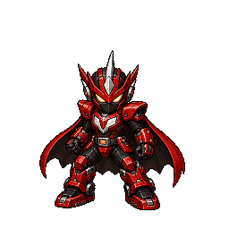
</p>

> A **MegaMan Battle Network–inspired NetNavi companion** for [Claude Code](https://claude.com/claude-code). A floating pixel-art desktop widget that watches you code, fights viruses (bugs), drops Battle Chips you can activate to push back, and speaks to you in committed BN-style dialogue — powered by your existing Claude Code OAuth, no API key required.

When Claude Code does work, the daemon sees the hook event in ~100ms. Your Navi reacts: animation state shifts, HP drains on error streaks, viruses spawn on build failures or test blowouts, chips drop on milestones, and dialogue is generated by a real LLM call grounded in your live state. The widget is styled as the *Personal Terminal* from the BN games — bezel, antenna, sigil header, status LEDs, animated viewport.

<p align="center">
  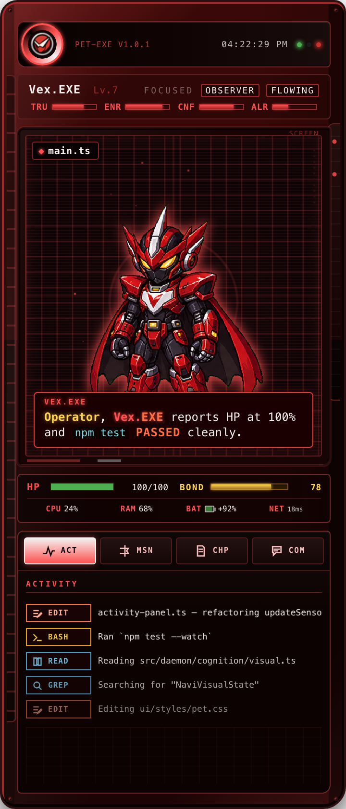
</p>

---

## Install

```bash
brew tap Topazoo/claudenavi
brew install claudenavi
brew services start claudenavi
claudenavi doctor
```

Works on **macOS** and **Linux (x86_64)**. ARM64 Linux works for CLI + daemon; the desktop widget is x86_64-only for now.

No API keys needed — the daemon spawns `claude -p` subprocesses and reuses your existing Claude Code OAuth session.

### Install directly from GitHub (without tapping)

```bash
brew install --formula https://raw.githubusercontent.com/Topazoo/homebrew-claudenavi/main/Formula/claudenavi.rb
```

Trade-off: `brew upgrade claudenavi` won't find new versions automatically. Tapping is recommended for normal use.

---

## Meet your Navi

Eight archetypes ship with production sprites + a distinct PET visual profile (chrome texture, viewport ambient, LED rhythm). Right-click the widget → **Switch Navi** to swap any time; HP, stats, level, and memories persist across the swap.

<table>
  <tr>
    <td align="center"><br><b>Vex.EXE</b><br><i>tactical, terse</i></td>
    <td align="center"><br><b>Pulse.EXE</b><br><i>balanced, encouraging</i></td>
    <td align="center"><br><b>Glitch.EXE</b><br><i>chaotic, fragmented</i></td>
    <td align="center">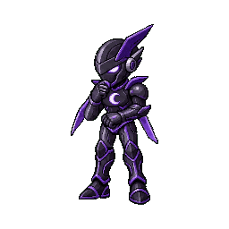<br><b>Shade.EXE</b><br><i>quiet, observant</i></td>
  </tr>
  <tr>
    <td align="center">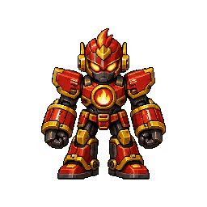<br><b>Ember.EXE</b><br><i>passionate, impatient</i></td>
    <td align="center">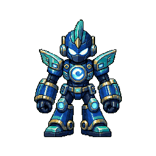<br><b>Wave.EXE</b><br><i>calm, deep thinker</i></td>
    <td align="center">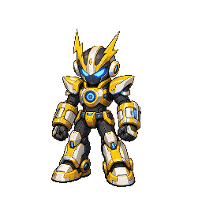<br><b>Volt.EXE</b><br><i>energetic, excitable</i></td>
    <td align="center">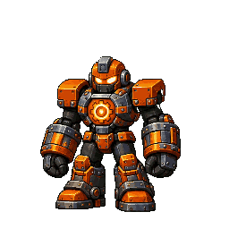<br><b>Forge.EXE</b><br><i>sturdy, methodical</i></td>
  </tr>
</table>

Each Navi animates across **10 states × 6 frames** — idle, battle stance, attack slash, attack projectile, damaged, victory, thinking, startled, excited, jack_in. The cognition pipeline picks the state every tick based on what's happening in your editor.

<p align="center">
  
  
  
</p>

---

## The PET — tabbed home + diagnostics

The widget's home screen is a tabbed deck: **Activity** (recent tool events + dialogue), **Mission** (current focus + chip drops), **Chips** (your 4-chip loadout + cooldowns), **Chat** (typed conversation with your Navi).

Right-clicking the device opens a context menu (Switch Navi / Diagnostics / Refresh state). **Diagnostics** mode flips the PET into a live observability surface — vitals, ops, memory pressure, sensor readouts — without leaving the widget.

<p align="center">
  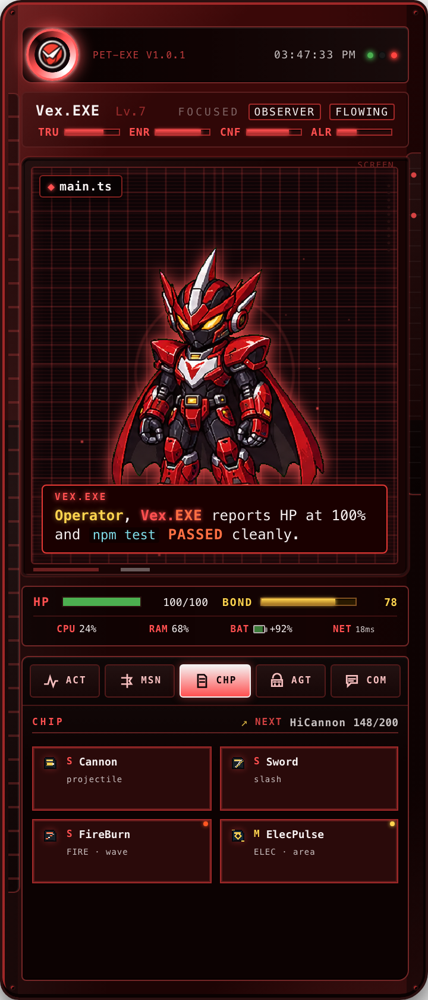
  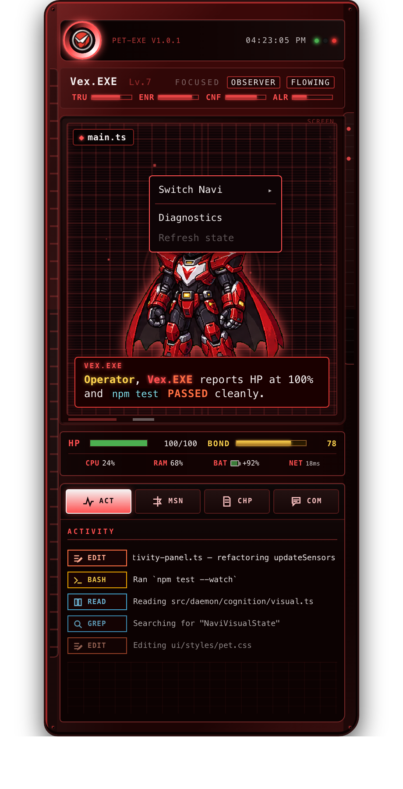
  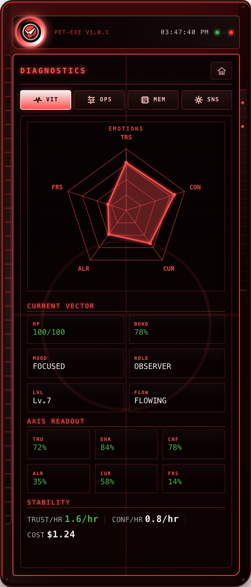
</p>

---

## Battle Chips — actively cast in battle

When the daemon catches an error streak, build failure, merge conflict, or test-suite blowout, a **virus spawns** and a battle starts. HP drains on every research failure while the battle is open.

<p align="center">
  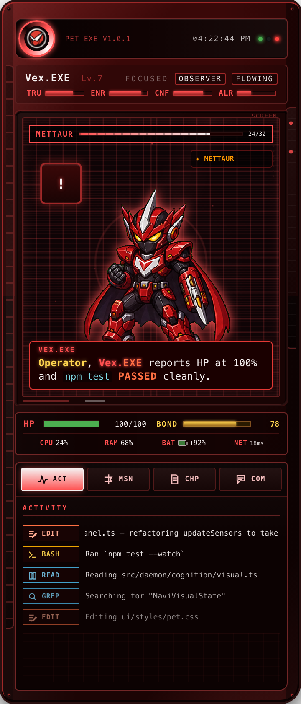
</p>

Battle Chips drop on milestones (PR merged, test suite green after fixes, etc.). You carry up to 4 chips into the next battle — they **auto-proc** based on tier (standard / mega / giga) and style (projectile / slash / wave / area / support / combo), or you can click a slot to cast manually. 25 chip types ship today, organized by tier + element (fire / aqua / elec / wood).

<p align="center">
  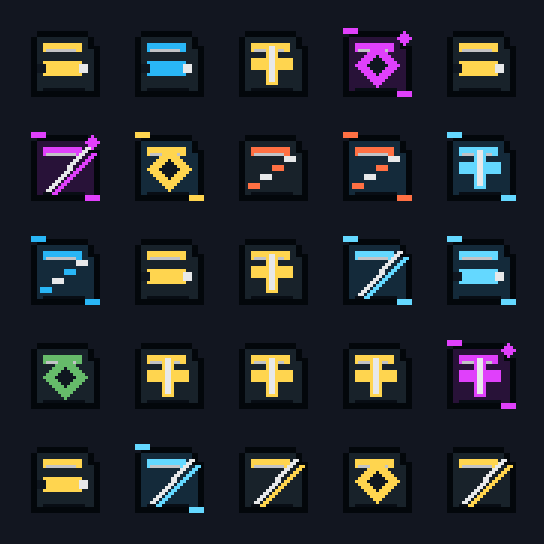
</p>

---

## What it does

ClaudeNavi runs as a background daemon that hooks into Claude Code. Every tool call (Read, Edit, Bash, etc.) fires the hook in ~100ms; the daemon reacts: sprite animations shift, mood changes, dialogue gets generated, viruses spawn, chips drop. Your Navi has its own personality, remembers sessions, and reacts to what you're actually doing — error streaks spawn viruses to battle, milestones unlock chips you can cast, late-night grinding changes its mood.

The widget is a Tauri v2 desktop app connecting to the daemon over an authenticated localhost WebSocket and rendering in real time. The auth token lives at `~/.claudenavi/ws-port` (chmod 600) so other local processes can't snoop on your Navi.

---

## How it works

```
Claude Code → PostToolUse hook → Unix socket → Daemon
                                                  │
Daemon ───────────────────────────────────────────┤
│  Life Engine:                                   │
│    hook_event → sanitize secrets → parse        │
│      → Pattern Tracker (streaks, bursts)        │
│      → HP Manager (drain on errors, regen)      │
│      → Battle Engine (spawn on streak/build)    │
│      → Chip Activation Engine (auto-proc        │
│           + manual cast, per-tier cooldowns)    │
│      → Mission Tracker (classify)               │
│      → Chip Tracker (milestone → chip drop)     │
│      → Cognition: perception → diff → appraise  │
│                   → express                     │
│      → Message Queue (P0-P3 priority)           │
│          │                                       │
│          ├─► template broadcast (instant)       │
│          └─► async dialogue.generate()          │
│                  │                               │
│                  └─► LLM upgrade (~3-5s)        │
│                                                  │
│  Sensors (5s/30s/60s): CPU, RAM, battery, git,  │
│                         active window, network   │
│                                                  │
├── WebSocket → Tauri Widget (PET device)         │
├── stdio → MCP Server → Claude Code (read-only) │
└── SQLite (WAL) → ~/.claudenavi/navi.db         │
```

Every hook runs in ~100ms. Dialogue is template-first (so the bubble appears instantly) with an async LLM upgrade that replaces the text in place ~4 seconds later. Data lives in `~/.claudenavi/navi.db` (SQLite, WAL mode, auto-backed-up daily via `VACUUM INTO`).

---

## CLI

After `brew install`, `claudenavi` is on your PATH:

| Command | What it does |
|---------|--------------|
| `claudenavi doctor` | Health check across daemon, hooks, MCP, DB, backups, widget |
| `claudenavi status` | Daemon status + core Navi vitals (HP, level, mood) |
| `claudenavi stats` | Detailed activity, files visited, operator profile |
| `claudenavi chips` | Chip inventory, current loadout, cooldowns |
| `claudenavi logs` | Tail recent daemon log entries |
| `claudenavi export <path>` | Snapshot `navi.db` (safe with live daemon) |
| `claudenavi import <path>` | Restore from snapshot (auto safety copy first) |
| `claudenavi reset` | Wipe Navi state + hatch a fresh one (install stays) |
| `claudenavi uninstall` | Remove hooks + MCP + daemon service (data preserved) |
| `claudenavi uninstall --all` | Full teardown including `~/.claudenavi/` |
| `claudenavi analyze` | Pull metrics over a time window (anomaly detection built in) |
| `claudenavi tune` | Inspect / adjust the ~80 numeric tuning params |
| `claudenavi daemon <status\|start\|stop\|restart\|run>` | Service management |
| `claudenavi simulate` | Life engine simulator (scripted scenarios or interactive) |
| `claudenavi mcp-serve` | MCP server over stdio (registered in `~/.claude/settings.json`) |

---

## Environment variables

| Variable | Default | Description |
|----------|---------|-------------|
| `CLAUDENAVI_DAILY_BUDGET_USD` | `15` | Daily USD cap for dialogue LLM spend. Above this, falls back to templates until local midnight |
| `NAVI_INTENT_SYSTEM` | `true` | Feature flag: intent-driven dialogue selector. Set to `false` for legacy topic-based selection |
| `CLAUDENAVI_DB_PATH` | `~/.claudenavi/navi.db` | Override DB path (used by the test suite with `:memory:`) |

---

## Requirements

- **macOS** (primary) or **Linux** (x86_64 for full widget; ARM64 for CLI + daemon only)
- **[Claude Code](https://claude.com/claude-code)** installed and signed in — the daemon spawns `claude -p` subprocesses
- **Node 22+** — auto-installed by Homebrew as a formula dependency
- **Linux only**: `libfuse2` is required for the AppImage widget. On Debian/Ubuntu: `sudo apt install libfuse2`. Or run with `ClaudeNavi.AppImage --appimage-extract-and-run`

No Python build dependency: starting with v0.2.2, the formula installs a pre-built daemon bundle with a universal `better-sqlite3` baked in. No `node-gyp` rebuild on your machine.

---

## Uninstall

```bash
claudenavi uninstall --all        # remove hooks, MCP, data
brew services stop claudenavi     # stop the daemon
brew uninstall claudenavi         # remove the formula
```

The `--all` flag wipes `~/.claudenavi/` and the settings.json backup files the installer created. Without it, your data is preserved for a future reinstall.

---

## Troubleshooting

Run `claudenavi doctor` first — it surfaces most common issues in one place.

| Symptom | Likely cause | Fix |
|---------|--------------|-----|
| Widget shows no events | Daemon not running | `brew services start claudenavi` |
| Dialogue never upgrades past template | Claude Code not signed in | `claude auth status` |
| "Hook timeout" warnings | Machine under heavy load | `claudenavi daemon restart` |
| Widget shows stale HP/mood | WebSocket desync | `claudenavi daemon restart` |
| "Another daemon is already running" | Pidfile guard caught a race | `claudenavi daemon status` then `restart` |
| DB looks corrupt | Auto-backup is at `~/.claudenavi/navi.db.bak` | `cp ~/.claudenavi/navi.db.bak ~/.claudenavi/navi.db && claudenavi daemon restart` |
| Need a clean slate | | `claudenavi uninstall --all && brew install claudenavi` |
| AppImage won't launch on Linux | Missing libfuse2 | `sudo apt install libfuse2` |

---

## Source

This is the Homebrew tap. The source code, issues, and full architectural documentation live at **[Topazoo/claudenavi](https://github.com/Topazoo/claudenavi)** (private).

Formula and release binaries (DMG, AppImage, daemon bundle) for the widget are versioned together in this repo — the formula points at releases in this same tap.

---

## License

MIT
